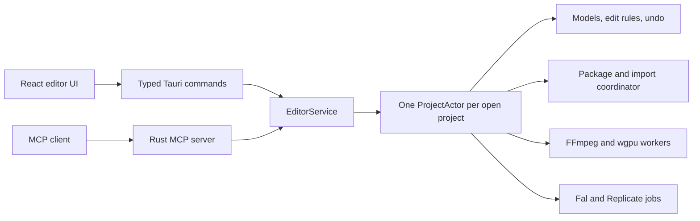

# Port Palmier Pro to Linux

## Target and boundaries
- Add an independent workspace at [linux/Cargo.toml](linux/Cargo.toml) with the Tauri app under [linux/app](linux/app). Keep [Package.swift](Package.swift) and the macOS app build unchanged.
- Target Ubuntu 26.04 x86_64. Ship a `.deb` that dynamically links the distro FFmpeg 8 libraries. Add a bootstrap script because this host currently lacks Rust, Clang, pkg-config, and FFmpeg.
- Treat [Sources/PalmierPro/Models/Timeline.swift](Sources/PalmierPro/Models/Timeline.swift), [Sources/PalmierPro/Models/ProjectFile.swift](Sources/PalmierPro/Models/ProjectFile.swift), and [Sources/PalmierPro/Models/MediaManifest.swift](Sources/PalmierPro/Models/MediaManifest.swift) as the compatibility contract. Linux must open and resave current macOS packages without changing their meaning.
- Complete the requested stages before review. Keep each stage buildable and tested before adding the next.
- Do not port Clerk, Convex, Sparkle, hosted Palmier chat, visual ML search, transcription, or ML denoise. Preserve unsupported serialized data. Preview and export must report unsupported visible features instead of silently dropping them. Full multicam, HDR, Lottie, and Metal effect parity are outside this requested inspector-basics release.

## Ownership and data flow

- `ProjectActor` is the only mutable owner of project state. UI commands and MCP tools submit the same typed `EditIntent` values and receive the same structured receipts.
- Every command carries a project revision. Interactive previews use the same pure Rust operation against a snapshot, and commit revalidates the revision before mutation.
- Blocking file work, FFmpeg work, rendering, provider calls, and keyring access run outside the project actor. Results commit only after cancellation and revision checks.

## 1. Workspace and compatibility contracts
- Create `palmier-core`, `palmier-project`, `palmier-media`, `palmier-mcp`, and `palmier-generation` crates. Make [linux/app/src-tauri/Cargo.toml](linux/app/src-tauri/Cargo.toml) the Tauri binary member.
- Pin a Rust toolchain and dependency versions. Use strict linting, TypeScript strict mode, React, Vite, and generated TypeScript bindings for Rust snapshots, commands, receipts, errors, and jobs.
- Port every persisted model and tolerant default, including legacy bare `Timeline` JSON, legacy transform coordinates, synthesized Swift enum shapes, UUID strings, Apple reference-date encoding, frame-domain integers, keyframes, text metadata, effects, multicam metadata, and generation metadata.
- Add semantic cross-runtime fixtures under [linux/fixtures/projects](linux/fixtures/projects). Rust tests read macOS fixtures and write deterministic Linux fixtures. A focused Swift compatibility test reads the Linux fixtures in macOS CI.

## 2. Open, save, and import
- Implement `.palmier` directory handling from [Sources/PalmierPro/Project/VideoProject.swift](Sources/PalmierPro/Project/VideoProject.swift) and [Sources/PalmierPro/Project/ProjectPackageCoordinator.swift](Sources/PalmierPro/Project/ProjectPackageCoordinator.swift).
- Save by building a complete sibling package, preserving media, thumbnails, chat files, unreadable `media.json`, and unknown package entries. Install with same-volume Linux atomic directory exchange. Queue admitted media commits behind saves, cancel them after failed saves, and reject late commits during close.
- Implement new, open, save, Save As, dirty state, recent projects, close confirmation, and command-line opening of `.palmier` directories.
- Import supported local video, audio, and image files as external references. Route downloaded, pasted, and generated media through staged package installs. Probe streams, rotation, duration, dimensions, frame rate, and audio with pinned `ffmpeg-next` native bindings.
- Build the home window and recognizable editor shell from [Sources/PalmierPro/Home/HomeView.swift](Sources/PalmierPro/Home/HomeView.swift) and [Sources/PalmierPro/Editor/EditorView.swift](Sources/PalmierPro/Editor/EditorView.swift). Start with Media, Preview, Inspector, and Timeline panels.

## 3. Timeline editing and undo
- Port the pure rules from [Sources/PalmierPro/Editor/OverwriteEngine.swift](Sources/PalmierPro/Editor/OverwriteEngine.swift), [Sources/PalmierPro/Editor/RippleEngine.swift](Sources/PalmierPro/Editor/RippleEngine.swift), and [Sources/PalmierPro/Editor/ViewModel/EditorViewModel+ClipMutations.swift](Sources/PalmierPro/Editor/ViewModel/EditorViewModel+ClipMutations.swift).
- Support track management, placement, overwrite, insert, select, move, duplicate, split, edge trim, slip, speed, delete, ripple delete, linking, nested timelines, keyframes, copy, paste, and project setting changes. Preserve half-open clip ranges and the exact speed-scaled rounding rules.
- Implement a Rust undo stack modeled on [Sources/PalmierPro/Editor/EditorUndo.swift](Sources/PalmierPro/Editor/EditorUndo.swift). One coherent UI or MCP intent creates one undo record. Validation failures and no-ops create none.
- Build the React timeline from [Sources/PalmierPro/Timeline/TimelineView.swift](Sources/PalmierPro/Timeline/TimelineView.swift): ruler, tracks, clip blocks, playhead, zoom, scroll, snapping, linked selection, drag ghosts, trim handles, razor, keyboard focus, and media drag and drop. Rust computes edit previews and final commits.

## 4. Preview and media caches
- Build one portable composition plan from [Sources/PalmierPro/Preview/CompositionBuilder.swift](Sources/PalmierPro/Preview/CompositionBuilder.swift). Reuse it for preview, frame capture, and export.
- Decode with native libav. Composite low-resolution preview frames with a headless `wgpu` renderer using crop, transform, opacity, keyframe interpolation, blend, speed, fades, text, and nested timeline semantics from [Sources/PalmierPro/Compositing/FrameRenderer.swift](Sources/PalmierPro/Compositing/FrameRenderer.swift).
- Mix preview audio in Rust and play it through `cpal`. Stream bounded compressed frame packets to the webview through Tauri binary channels, dropping stale frames rather than building a queue.
- Add exact paused-frame rendering, scrub cancellation, play and seek generation checks, thumbnail generation, filmstrip caching, and waveform extraction. Give every cache a bounded capacity and a key based on source identity, size, modification time, and render settings.
- Implement the viewer transport and timeline playhead synchronization from [Sources/PalmierPro/Preview/PreviewContainerView.swift](Sources/PalmierPro/Preview/PreviewContainerView.swift).

## 5. Export
- Reuse the composition plan, frame renderer, and audio mixer in `palmier-media`. Encode through native libav to staged output, then atomically install the finished file.
- Ship H.264 with AAC first inside this stage. Add H.265 and ProRes when the Ubuntu FFmpeg build exposes the encoder. Port XML and FCPXML output because their logic is portable. Report unavailable codecs as capabilities, never as silent fallbacks.
- Match resolution, even-dimension scaling, source timing, transforms, color tags, cancellation, progress, missing-media reports, and the single-active-export queue in [Sources/PalmierPro/Export/ExportService.swift](Sources/PalmierPro/Export/ExportService.swift).
- Add the export sheet and durable job UI. Verify output by reopening it with libav and checking streams, duration, selected frames, and cancellation cleanup.

## 6. MCP editing tools
- Implement a loopback-only server at `http://127.0.0.1:19789/mcp` with the official Rust MCP SDK. Preserve stateful compatibility for protocol `2025-06-18`, session headers, validation, SSE attachment, tool-list notification behavior, and local origin checks from [Sources/PalmierPro/Agent/MCP/MCPHTTPServer.swift](Sources/PalmierPro/Agent/MCP/MCPHTTPServer.swift).
- Port the applicable schemas and receipts from [Sources/PalmierPro/Agent/Tools/ToolDefinitions.swift](Sources/PalmierPro/Agent/Tools/ToolDefinitions.swift) and [Sources/PalmierPro/Agent/Tools/ToolExecutor+MutationDelta.swift](Sources/PalmierPro/Agent/Tools/ToolExecutor+MutationDelta.swift). Advertise only implemented capabilities.
- Cover project, timeline, media, clip, track, text, supported color and effect, export, frame capture, and undo tools. Keep stable IDs, full preflight validation, atomic multi-entity edits, explicit no-op receipts, short-ID expansion, and readback vocabulary.
- Route every mutation through `EditorService`. Add real HTTP tests for discovery, mutation, independent readback, undo, export jobs, invalid input, inactive projects, and session lifecycle.

## 7. Inspector basics and UI parity
- Implement project settings and single or multi-clip controls for transform, crop, opacity, speed, volume, fades, track visibility, and supported keyframes based on [Sources/PalmierPro/Inspector/InspectorView.swift](Sources/PalmierPro/Inspector/InspectorView.swift).
- Mirror [Sources/PalmierPro/UI/AppTheme.swift](Sources/PalmierPro/UI/AppTheme.swift) into one Linux theme module and CSS variable set. Components must not contain raw spacing, color, radius, font, or timing values.
- Add the three workspace layouts, panel toggles, focus rings, native Linux menu shortcuts, Escape behavior, text-field shortcut guards, import progress, offline media states, and terminal error or cancellation states.
- Reuse the existing localization catalogs at build time and keep filenames, user text, provider metadata, MCP contracts, and persisted values verbatim.

## 8. Optional BYOK generation and packaging
- Implement Fal and Replicate adapters behind one job interface. Use provider-specific request mapping from a versioned static catalog, resumable polling, cancellation, bounded downloads, reference upload, and staged project-media commits.
- Store `fal-api-key` and `replicate-api-token` only through Linux Secret Service. If no keyring is available, disable generation with an actionable error and no plaintext fallback.
- Replace account and credit checks with `canGenerate` based on a configured provider key. Preserve placeholder assets and `generationStatus` behavior so the UI and MCP `get_media` can observe preparing, running, downloading, ready, failed, and cancelled outcomes.
- Add Settings and Media-panel generation UI plus `list_models`, `generate_video`, `generate_image`, `generate_audio`, and `upscale_media` MCP tools. Test providers with mock HTTP servers and an injected in-memory credential store.
- Add [linux/scripts/bootstrap-ubuntu-26.04.sh](linux/scripts/bootstrap-ubuntu-26.04.sh), a Linux CI workflow, desktop metadata, icons, MIME metadata, and `.deb` bundling. Document system FFmpeg 8 and Secret Service requirements.

## Verification gates
- Rust: `cargo fmt --check`, `cargo clippy --workspace --all-targets -- -D warnings`, and `cargo test --workspace` after each stage.
- Frontend: `npm ci`, type checking, linting, Vitest component and interaction tests, and a production build.
- Packaging: build the Tauri `.deb` in an Ubuntu 26.04 CI container and install it into a clean test image.
- Compatibility: run the new Swift fixture test plus the existing macOS project, timeline, undo, export, and MCP suites in macOS CI. The local Linux host cannot run Swift.
- End to end: use isolated projects to verify open, import, edit, undo, save, reopen, preview, export, MCP readback and undo, provider failure, generation completion, app close during work, and missing media.
- UI: run the app and manually check pointer and keyboard edits, drag and drop, focus, Escape, disabled states, playback, export cancellation, close confirmation, and empty or offline projects. Do not mark UI verification complete until confirmed.